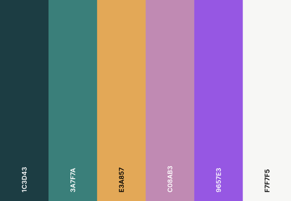
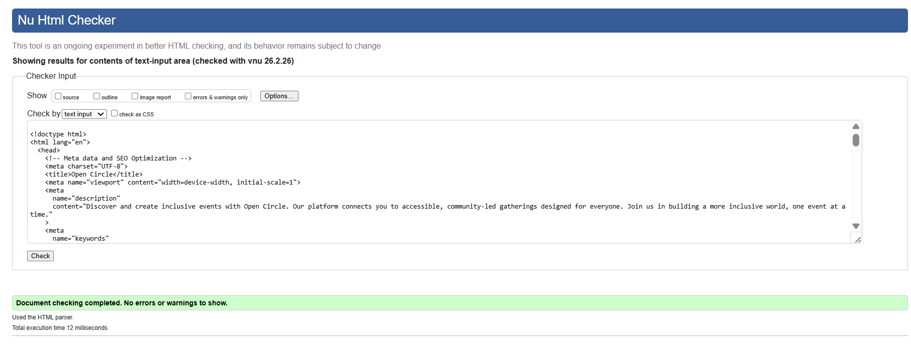
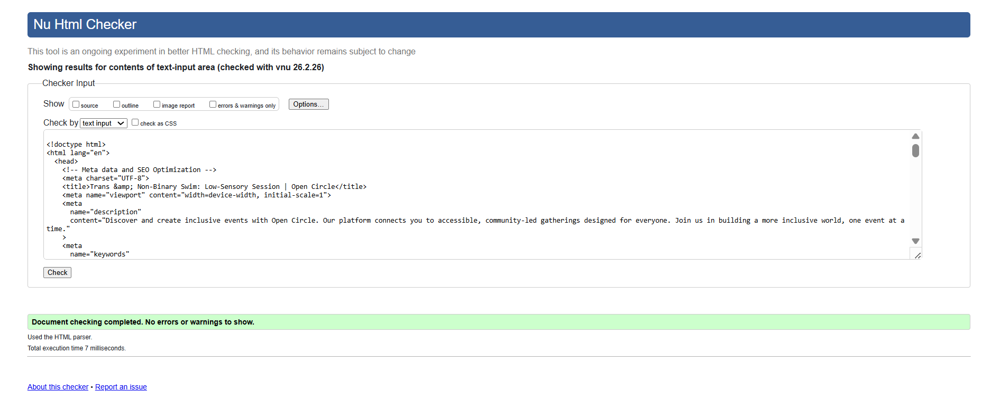
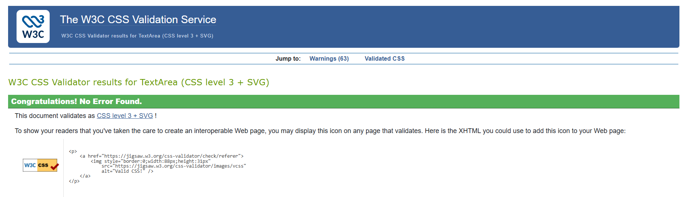
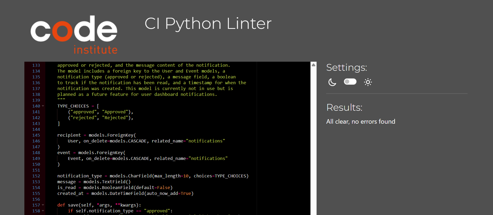
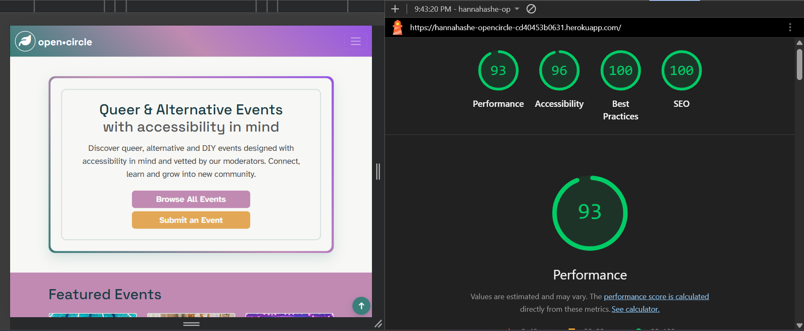
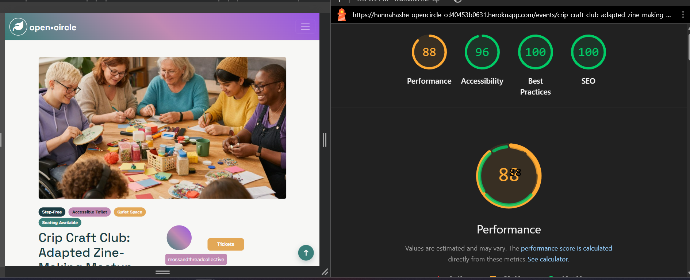
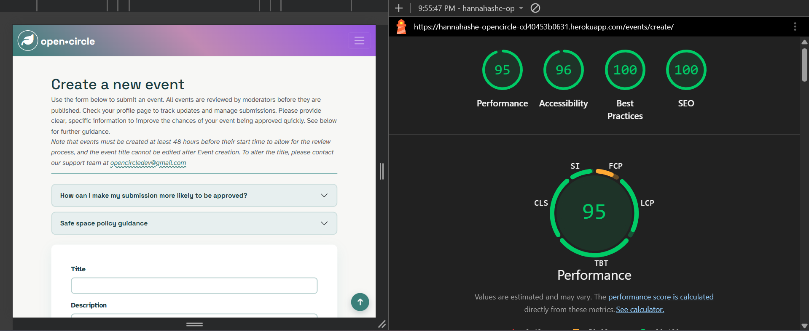

 # Open Circle | Accessible Events Directory
A moderated, accessibility-first events directory designed for queer and alternative communities.

Live site: https://hannahashe-opencircle-cd40453b0631.herokuapp.com/
 
 # Table of Contents
- [Open Circle | Accessible Events Directory](#open-circle--accessible-events-directory)
- [Table of Contents](#table-of-contents)
- [Design \& Planning](#design--planning)
  - [User Stories](#user-stories)
      - [Epic 1 – Public Event Discovery](#epic-1--public-event-discovery)
      - [Epic 2 – Authentication \& Access Control](#epic-2--authentication--access-control)
      - [Epic 3 – Organiser Event Management](#epic-3--organiser-event-management)
      - [Epic 4 – Moderation \& Trust](#epic-4--moderation--trust)
      - [Epic 5 – Notifications](#epic-5--notifications)
  - [Wireframes](#wireframes)
  - [Agile Methodology](#agile-methodology)
  - [Typography](#typography)
  - [Colour Scheme](#colour-scheme)
  - [Database Diagram](#database-diagram)
    - [Core Models](#core-models)
    - [Relationships](#relationships)
- [Features](#features)
  - [Navigation](#navigation)
  - [Footer](#footer)
  - [Home page](#home-page)
  - [Profile page](#profile-page)
  - [Create \& Edit Event pages](#create--edit-event-pages)
  - [Event list \& Event detail pages](#event-list--event-detail-pages)
  - [CRUD](#crud)
  - [Authentication \& Authorisation](#authentication--authorisation)
- [Technologies Used](#technologies-used)
- [Libraries](#libraries)
- [Testing](#testing)
  - [Validation](#validation)
  - [Lighthouse Testing](#lighthouse-testing)
  - [Responsiveness](#responsiveness)
  - [Browser Compatibility](#browser-compatibility)
  - [Manual Testing Against User Stories](#manual-testing-against-user-stories)
  - [Feature testing](#feature-testing)
- [Bugs](#bugs)
- [Deployment](#deployment)
- [Ai](#ai)
- [Credits](#credits)

 # Design & Planning
 ## User Stories
The project was built around five MVP epics:
#### Epic 1 – Public Event Discovery
- View approved upcoming events
- View detailed event information
- Filter by structured accessibility criteria
- Navigate paginated results
#### Epic 2 – Authentication & Access Control
- Register, log in and log out securely
- Role-based UI visibility
- Restricted access to organiser and admin actions
#### Epic 3 – Organiser Event Management
- Create events
- Edit/delete own events
- Edited events return to Pending
#### Epic 4 – Moderation & Trust
- Admin approval/rejection workflow
- Optional rejection feedback
- Approved events only publicly visible
#### Epic 5 – Notifications
- In-app moderation notifications for organisers
  
All must-have and should-have user stories were tested manually and validated as complete.

 ## Wireframes
Wireframes were created using Figma.

 ## Agile Methodology
 - This project followed Agile principles using:
 - GitHub Projects board
 - User stories with acceptance criteria
 - Iterative development
 - MoSCoW prioritisation
 - Project board includes:
 - - Epics
 - - User stories
 - - Tasks
 - - Labels
- Link to project board: https://github.com/users/hannahashe/projects/6

 ## Typography
 - The accessibility-focused goals of the project informed the choices for design, including font choices. 
 - Clean, readable sans-serif typography
 - Clear hierarchy between headings, metadata, and body content
 - Accessibility-first sizing and spacing
 - SPACE GROTESK was used as the main heading font. 
 - Atkinson Hyperlegible was used as the main body font.
 ## Colour Scheme
The colour palette was carefully selected to balance visual appeal with accessibility requirements:

| Colour Type | Hex Codes | Purpose |
|:---|:---|:---|
| Primary | #3a7f7a, #c08ab3, #9657e3 | Core brand identity and key interface elements |
| Secondary | #1c3d43, #7c4c7b, #e3a857 | Supporting accents and complementary design |
| Neutral | #f7f7f5 | Backgrounds and subtle surfaces |
| Text | #1f1f1f, #4a4a4a | Primary and secondary text for readability |

The colour combination prioritises readability and reduces sensory overwhelm for neurodivergent users while maintaining a modern, professional appearance.

 
 

 - Calm, low cognitive-load palette
 - Accessibility-first contrast consideration
 - Soft background tones with high-contrast text

 ## Database Diagram
 ### Core Models
 - User (Django built-in)
 - Profile
 - Event
 - Notification (future feature)
 ### Relationships
- User ↔ Profile (OneToOne)
- User ↔ Event (ForeignKey as organiser)
- Event ↔ Notification (ForeignKey)
  
- SCREENSHOT OF ERD
- MERMAID FLOWCHART

 # Features
 
 ## Navigation
 - Responsive collapsing Bootstrap Navbar 
 - Role-based link visibility
 - Login/Logout conditional rendering
 - Accessible pagination
 ## Footer
 - Consistent site-wide footer
 - Minimal, non-distracting design
 - Social links, copyright and contact information
 ## Home page
 - Hero section & CTA buttons for Browse events & Create an event (call-to-action to attendees & organisers)
 - Featured events section 
 - Our values section, explaining the event moderation process and the ethics of the platform.
 ## Profile page 
 - Displays user details (email, username, organiser status)
 - Displays profile image and input for user uploaded images, including guidelines on file size.
 - "My events" section shows edit/delete buttons, moderation status (Approved, Pending, Rejected), conditional link to the Event detail page *only* if the event has been approved.
 - On login, when clicking on the profile page, an organiser recieves messages regarding the rejection or approval of their event. 
 - Rejection message (either default or custom added by Admin) is displayed in the table *only if* the event has been rejected.
 ## Create & Edit Event pages 
 - Structured form validation
 - Accessibility fields required 
 - Edited events return to pending and organiser is notified of successful event submission
 - Server-side ownership enforcement
 - Accordions displaying guidelines for successful submissions
 ## Event list & Event detail pages
 - Public browsing of approved events
 - Structured accessibility display
 - Paginated results
 - Search function covering keywords, accessibility filters, start datetime & end datetime filters.
 ## CRUD
 | Action      | Visitor | User | Organiser | Admin |
| :---        |    :----:   |          ---: |          ---: |          ---: |
| Create         | No | No | Yes | Yes |
| Read           | Yes | Yes | Yes | Yes |
| Update Own     | No | No | Yes | Yes |
| Update Any     | No | No | No | Yes |
| Delete Own     | No | No | Yes | Yes|
| Approve/Reject | No | No | No | Yes

 ## Authentication & Authorisation
 - Django AllAuth authentication
 - Role-based permissions
 - Server-side ownership checks
 - Moderation workflow 
 - Hidden UI elements for unauthorised users 
  
 # Technologies Used 
 - Python 3.12
 - Django 
 - PostgreSQL (Production)
 - SQLite (Development)
 - HTML5
 - CSS3
 - Bootstrap 6
 - Heroku
 - Cloudinary
 - WhiteNoise
 - Gunicorn
 - Git & Github
 # Libraries
 - dj-database-url
 - psycopg2 / psycopg2-binary
 - django-allauth
 - cloudinary
 - pillow
 - whitenoise
 - gunicorn

 # Testing
 ## Validation
 - HTML validated via W3C Validator 
  
  
 - CSS validated via WSC Validator 
  
 - Python validated using CI Python Linter
  

 No critical errors present

 Screenshots of all Validators can be found in static/images/readme-images/html-css-validation

 ## Lighthouse Testing
 Tested on:
 - Homepage
 - Event List
 - Event Detail
 - Event create/edit
 - Profile
 - sign up, log in, log out
 - Both Mobile & Desktop tested.

 
 
 

 Screenshots of all Lighthouse reports can be found in static/images/readme-images/lighthouse-reports

## Responsiveness
 Tested using:
 - Chrome DevTools and different physical devices.
 - Multiple viewport sizes
 - Desktop, tablet, mobile breakpoints
  
 INSERT SCREENSHOTS HERE
## Browser Compatibility
 Tested on:
 - Chrome
 - Firefox
 - Edge
 All core features functon as expected.
## Manual Testing Against User Stories
 Testing table with SCREENSHOTS insert here, test against every "done" user story, pasinggrade.
## Feature testing
 All implemented features tested manually table here. 
 # Bugs 
- list of bugs & fixes
 # Deployment 
 - include creation of github repo, app creation on heroku, creating database, deploying to heroku
 # Ai
 Ai tools (ChatGPT, Microsoft Copilot, VS Code Copilot) were used to:
 - Refine user stories
 - Debug configuration issues 
 - Profile signal.py setup 
 - Admin panel development
 - Login & sign up template implementation
 - Generate documentation structure 
 - Improve README table formatting
 - Troubleshoot deployment errors
All code was reviewed, understood and adapted before implementation.

 # Credits 
 - Django Documentation
 - Code Institute course materials
 - Bootstrap documentation
 - Heroku documentation
 - Freepik for free stock images: https://www.freepik.com/app
 - ChatGPT Codex for debugging and explanatory prompts